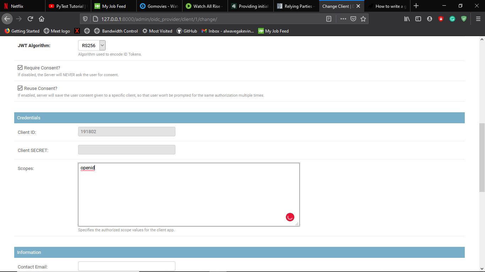

#ECommerce App
a simple app that manages customers orders and notifications


## Table of contents
* [General info](#description)
* [Technologies](#technologies)
* [File Structure](#file-structure)
* [Installation](#installation)
* [Testing](#test)


## Description
A simple Python-Django API that implements ordering of items by registered users whom are customers it will be
 composed of three apps:-
 * <b>Orders</b>: app for managing customer orders
 * <b>Sms</b>: app for managing user notifications
 * <b>Users</b>: app for managing users of the application whom are customers
 `

## Technologies
This Project is created with:
* Python version: 3.9
* Pip version: ~> 20.2
* VirtualEnv: 20.1.0

## File Structure
The app is developed trying to follow the SOLID principles of object oriented programming
  > ##### base
     this module will hold filesthat implements function that will be shared throughout the project
     
     utility: - will hold helper functions that will generally makes things/processes easier during development
  > ##### backend (services, utility)
        services: - Will be used in querying the database all logic on how  we will be querying, 
        making entries, transaction basically interacting with the database is handle by the services. 
        every  app will implements services.(simply implements the CRUD operations)
        
        interfaces: holds the logic and methods that the app views should implement or do before making an 
         entry to the database 
         
## installation
 >installation of the app is very simple all you need Python installed in your machine and a virtualenv for creating
> virtual environments so my assumption is that you already have python and virtualenv installed in your machine if
> not the instructions also covers virtualenv installation
>to install python please vistit python org and pick the version you want to install

To run this project, install it locally using pip:
```
$ git clone this repository
$ pip install virtualenv
$ virtualenv venv
$ venv\Scripts\activate
$ pip install -r requirement.txt
$ python manage.py makemigrations
$ python manage.py migrate
$ python manage.py creatersakey
```


## Testing
To test the endpoints of the app please ensure you have installed postman if not follow:- 
* [Postman](https://www.postman.com/downloads/)

after you have finished installing in the project navigate to the directory:
* E-commerce/collections/
and import the json file to your postman you should see a collection called Ecommerce with its endpoints as follows:

     
     
 once this done before testing the endpoints you will need to run the following commands and activate the local
  server for testing
  ```
    $ python manage.py loaddata fixtures/Ecommerce
    $ python manage.py createsuperuser
    $ python manage.py runserver
  ```

after creating a super user and running the server login to the admin and create an oidc provider client for login
 please use this details to fill:
 * Name: customer
 * Owner: 2(the id of the superuser you created)
 * Response Types: id_token token(implicit flow) 
 * Client Type: public
 * RedirectURIs: http://127.0.0.1:8000/
 * Scopes: openid
 
 it should look as follows once complete:
    
 
 
 
 
 on Authenticate User endpoint in the collection change the
 * client_id: to your generated client id
 
 call the endpoint and update all the other endpoint access token to your access_token returned in the response
 
 

